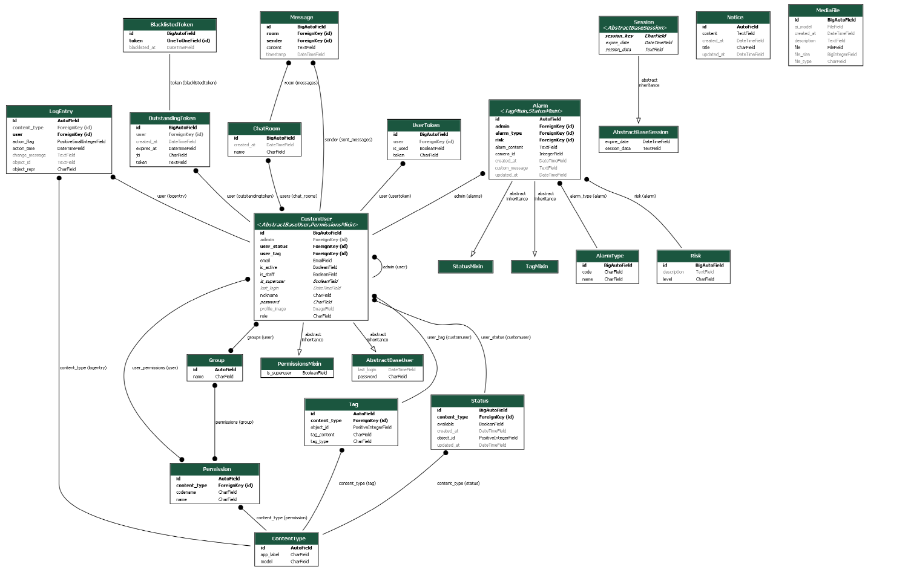

# Safe Eye 프로젝트 중간 발표

안녕하세요, 저희는 Safe Eye 프로젝트 팀입니다. 오늘 여러분께 저희 프로젝트의 중간 진행 상황과 향후 계획에 대해 발표하고자 합니다.

## 프로젝트 개요

Safe Eye는 CCTV 카메라와 AI 기술을 활용하여 공간 안전을 강화하고자 만든 프로젝트입니다. 컴퓨터 비전 및 인공지능 기술을 통해 CCTV 영상을 실시간으로 분석하고, 잠재적인 위험 상황을 신속하게 감지하여 안전 관리자에게 알람을 전송합니다. 이를 통해 사고 예방 및 신속한 대응이 가능해집니다.

저희 팀은 이 프로젝트를 통해 AI 기술이 실생활에 어떻게 적용될 수 있는지 보여주고, 나아가 사회 안전에 기여하고자 합니다.

## 주요 기능

Safe Eye 프로젝트는 다음과 같은 주요 기능을 제공할 예정입니다:

1. 실시간 이상 행동 감지

   - CCTV 영상에서 사람들의 행동을 실시간으로 분석하여 이상 행동을 감지합니다.
   - 폭력, 절도, 기물 파손 등 다양한 유형의 이상 행동을 인식할 수 있습니다.
   - 이상 행동 발생 시 즉각적인 알람을 발송하여 신속한 대응을 촉진합니다.

2. 상세 분석 화면

   - 선택한 카메라 또는 영역의 고해상도 비디오 피드를 제공합니다.
   - 감지된 이벤트 목록과 상세 정보를 확인할 수 있습니다.
   - 사용자 메모 및 설명을 추가할 수 있는 기능을 제공합니다.
   - 비디오 클립, 스크린샷, 이벤트 데이터를 내보낼 수 있습니다.

3. 경고 및 알람 설정

   - 경고 및 알람 수준에 따른 특정 작업을 설정할 수 있습니다.
   - 생성형 AI 모델을 활용하여 맥락에 적합한 경고 및 알람 메시지를 자동으로 생성합니다.
   - 사용자가 알림 메시지와 수신자 목록을 사용자 정의할 수 있습니다.
   - 정기적인 테스트와 훈련을 예약할 수 있는 기능을 제공합니다.

4. 통계 및 보고 기능

   - 기간별 이벤트에 대한 상세 보고서를 생성합니다.
   - 이벤트 데이터를 필터링하고 정렬할 수 있는 옵션을 제공합니다.
   - 통계 데이터, 이벤트 로그, 보고서를 내보낼 수 있습니다.
   - 자동으로 보고서를 생성하고 전달하도록 예약할 수 있습니다.

5. 사용자 관리 및 설정
   - 사용자 프로필 정보를 업데이트하고 알림 기본 설정을 변경할 수 있습니다.
   - 시스템 상태를 모니터링하고 진단할 수 있는 도구를 제공합니다.
   - 각 사용자의 상태에 따라 알람을 분류합니다.

## 기술 스택

Safe Eye 프로젝트는 다음과 같은 기술 스택을 활용하여 개발되고 있습니다:

- 백엔드: Django, DRF Pillow 등

  - Django와 Django REST Framework를 사용하여 백엔드 API를 구축하고 있습니다.
  - Pillow를 활용하여 이미지 처리 및 변환을 수행합니다.

- 프론트엔드: Next.js

  - React 기반의 Next.js 프레임워크를 사용하여 사용자 친화적인 인터페이스를 개발하고 있습니다.
  - 서버 사이드 렌더링과 서스펜스, 프리패칭 등을 이용하여 효과적으로 빠른 개발을 하며, seo를 신경 씁니다..

- 머신러닝: TensorFlow, PyTorch(예상)

  - TensorFlow와 PyTorch를 활용하여 AI 모델을 학습하고 배포합니다.
  - LSTM과 MIL Ranking 모델을 사용하여 이상 행동을 인식합니다.

- 컴퓨터 비전: OpenCV

  - OpenCV 라이브러리를 사용하여 영상 처리 및 분석을 수행합니다.
  - 객체 인식, 추적, 분할 등의 기능을 활용합니다.

- 데이터베이스: PostgreSQL

  - PostgreSQL을 사용하여 데이터를 저장하고 관리합니다.
  - 확장성과 안정성을 고려하여 선택했습니다.

- 실시간 처리: Apache Kafka(예상)

  - Apache Kafka를 활용하여 실시간 데이터 스트리밍 및 처리를 수행합니다.
  - 대용량 데이터를 빠르게 처리하고 시스템 간 데이터 전달을 원활하게 합니다.

- DevOps: Docker, Kubernetes
  - Docker를 사용하여 애플리케이션을 컨테이너화하고 배포합니다.
  - Kubernetes를 활용하여 컨테이너 오케스트레이션 및 스케일링을 관리합니다.

## 데이터베이스 모델링(ER Diagram)

- AbstractBaseUser 테이블 : 사용자 인증을 위한 기본 필드를 제공하는 추상 모델입니다.
- PermissionsMixin 테이블 : 사용자 권한 관련 필드를 제공하는 믹스인 클래스입니다. AbstractUser 모델에서 해당 믹스인을 사용하여 권한 관련 기능을 추가합니다.
- AbstractUser 테이블 : User 모델의 기반이 되는 추상 사용자 모델입니다. AbstractBaseUser와 PermissionsMixin을 상속받아 구현되었습니다.
- User 테이블 : Django의 기본 User 모델입니다. 사용자 정보를 저장하는 역할을 합니다. AbstractUser를 상속받아 구현되었습니다.
- CustomUser 테이블 : User 모델을 상속받아 확장한 커스텀 사용자 모델입니다. User 모델의 필드를 포함하면서 추가적인 필드(bio, profile_name 등)를 가지고 있습니다.
- Group 테이블 : 사용자 그룹 정보를 저장하는 테이블입니다. User 테이블과 다대다 관계를 가지고 있습니다.
- Permission 테이블 : 권한 정보를 저장하는 테이블입니다. ContentType 테이블과 외래 키 관계를 가지고 있습니다.
- ContentType 테이블 : Django의 ContentType 프레임워크에서 사용되는 테이블입니다. 모델 클래스를 식별하기 위한 정보를 저장합니다. 
                      Permission 테이블과 LogEntry 테이블에서 외래 키로 사용됩니다.
- Content 테이블 : 컨텐츠 정보를 저장하는 테이블입니다. User 테이블과 ContentType 테이블과 외래 키 관계를 가지고 있습니다.
- LogEntry 테이블 : Django의 Admin 로그 정보를 저장하는 테이블입니다. User 테이블과 ContentType 테이블과 외래 키 관계를 가지고 있습니다.
- AbstractBaseSession 테이블 : Session 모델의 기반이 되는 추상 세션 모델입니다. Session 모델에서 공통적으로 사용되는 필드를 정의합니다.
- Session 테이블 : 사용자의 세션 정보를 저장하는 테이블입니다. AbstractBaseSession을 상속받아 구현되었습니다.
- OutstandingToken 테이블 : Django REST framework의 토큰 인증 방식에서 사용되는 테이블입니다. User 테이블과 외래 키 관계를 가지고 있습니다.
- BlacklistedToken 테이블 : 블랙리스트에 등록된 토큰 정보를 저장하는 테이블입니다. OutstandingToken 테이블과 외래 키 관계를 가지고 있습니다.
- Site 테이블 : Django의 Site 프레임워크에서 사용되는 테이블입니다. 웹사이트의 도메인과 이름을 저장합니다.

## 진행 상황

저희 팀은 현재까지 다음과 같은 작업을 진행했습니다:

1. 프로젝트 아키텍처 설계 및 기획

   - 프로젝트의 전반적인 아키텍처를 설계하고, 필요한 기능과 요구사항을 정의했습니다.
   - 각 구성 요소 간의 상호 작용과 데이터 흐름을 고려하여 시스템 구조를 설계했습니다.

2. 백엔드 앱 구조 설계 및 개발

   - Django 프레임워크를 사용하여 백엔드 애플리케이션의 기본 구조를 설계했습니다.
   - accounts, utils, media, alarm, notice 등의 앱을 생성하고, 각 앱의 모델과 API 엔드포인트를 개발했습니다.

3. 프론트엔드 개발 환경 구축 및 초기 화면 개발
   - Next.js 프레임워크를 사용하여 프론트엔드 개발 환경을 구축했습니다.
   - 초기 화면 디자인을 작성하고, 컴포넌트 기반으로 UI를 개발하기 시작했습니다.

또한, 저희 팀은 GitHub의 이슈 템플릿, 위키, 프로젝트 기능을 활용하여 효율적으로 프로젝트를 관리하고 있습니다. 실시간 소통과 협업은 디스코드를 사용합니다.

## 남은 작업 및 계획

앞으로 저희 팀이 진행할 주요 작업은 다음과 같습니다:

1. AI 모델 선정 및 학습

   - 기업에서 선정된 모델을 저희의 프로젝트에 적용시켜 봅니다.

2. 프론트엔드 UI/UX 개선 및 기능 구현

   - 사용자 피드백을 반영하여 UI/UX를 지속적으로 개선해 나갈 예정입니다.
   - 설계된 기능들을 프론트엔드에 구현하고, 백엔드 API와 연동하여 완성도를 높일 것입니다.

3. 백엔드 API 완성 및 문서화

   - 백엔드 API의 구현을 완성하고, 코드 리팩토링과 최적화를 진행할 예정입니다.
   - API 문서를 작성하여 프론트엔드 개발자와 협업할 수 있는 기반을 마련할 것입니다.

4. 실시간 알람 시스템 구현

   - Apache Kafka를 활용하여 실시간 알람 시스템을 구현할 예정입니다.
   - 이상 행동 감지 시 실시간으로 알람을 생성하고 전송하는 기능을 개발할 것입니다.

5. 통합 테스트 및 배포 준비

   - 개발된 기능들을 통합하고, 전체 시스템에 대한 테스트를 수행할 예정입니다.
   - 배포를 위한 인프라 구성 및 배포 자동화 스크립트를 작성할 것입니다.

6. AI 모델 최적화 및 성능 향상

- 현재 학습된 AI 모델의 성능을 평가하고, 하이퍼파라미터 튜닝 등을 통해 모델을 최적화할 예정입니다.
- 실제 환경에서의 테스트를 통해 모델의 일반화 능력을 검증하고 개선해 나갈 것입니다.

저희 팀은 남은 기간 동안 이러한 작업들을 차질 없이 진행하여, 프로젝트를 성공적으로 완료하고자 합니다.

## 맺음말

프로젝트를 진행하면서 많은 것을 배우고 성장하고 있습니다. 팀원들 간의 협업과 소통을 통해 시너지를 내고, 어려움을 함께 극복해 나가고 있습니다. 이 과정에서 얻은 경험과 지식은 향후 저희의 발전에 소중한 자산이 될 것입니다.

Safe Eye 프로젝트가 성공적으로 완료되어 언젠가 실제 현장에서 이러한 기술을 적용할 때 도움이 되기를 희망합니다. 여러분의 관심과 응원이 저희에게 큰 힘이 될 것입니다. 함께 더 안전한 사회를 만드는 게발자가 되고 싶습니다.

감사합니다!
