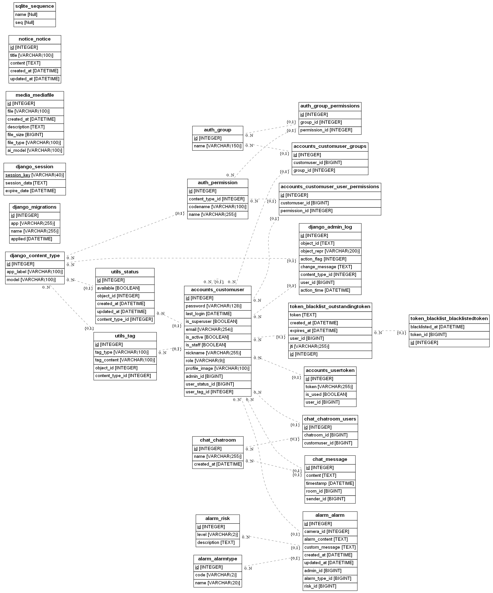

# Safe-Eye: 비디오 감시 및 이상 행동 감지 시스템

Safe-Eye는 PySlowFast 모델과 Django 웹 프레임워크를 활용한 비디오 감시 및 이상 행동 감지 시스템입니다. 이 프로젝트는 CCTV 또는 보안 카메라에서 수집된 비디오 데이터를 실시간으로 분석하여 잠재적인 위험 상황을 탐지하고 대응할 수 있도록 설계되었습니다.

## 주요 기능

### 비디오 업로드 및 스토리지 연동
- 사용자는 분석할 비디오 파일을 웹 애플리케이션을 통해 업로드할 수 있습니다.
- 업로드된 비디오 파일은 Amazon S3 스토리지에 안전하게 저장됩니다.
- Django 애플리케이션은 S3에 저장된 비디오 파일의 URL을 PySlowFast 모델에 전달합니다.

### PySlowFast 모델을 통한 비디오 분석
- Facebook AI Research에서 개발된 PySlowFast 모델을 활용하여 비디오 데이터를 분석합니다.
- 모델은 비디오 프레임에서 이상 행동 패턴을 감지하고 분류합니다.
- 감지된 이상 행동에 대한 좌표 정보와 관련 이미지를 생성합니다.

### 이상 행동 감지 및 결과 제공
- 시스템은 다음과 같은 이상 행동을 감지할 수 있습니다: 전도, 파손, 방화, 흡연, 유기, 절도, 폭행, 교통약자 위협 등.
- 감지된 이상 행동에 대한 결과는 JSON 형식으로 Django 애플리케이션에 반환됩니다.
- 결과에는 이상 행동 유형, 위치 좌표, 관련 이미지 경로 등의 정보가 포함됩니다.

### Django REST API를 통한 분석 결과 제공
- Django REST API를 통해 비디오 분석 결과를 클라이언트 애플리케이션에 제공합니다.
- API 엔드포인트를 호출하여 이상 행동 감지 결과를 실시간으로 가져올 수 있습니다.
- 분석 결과는 웹 애플리케이션, 모바일 앱 또는 타사 시스템에 통합될 수 있습니다.

## 기술 스택(백엔드, 프론트엔드)
- 프론트엔드(링크)
- PySlowFast: Facebook AI Research에서 개발한 비디오 분석 모델
- Django: 웹 애플리케이션 프레임워크
- Django REST Framework: API 개발을 위한 툴킷
- Amazon S3: 클라우드 스토리지 서비스
- React (또는 Vue.js): 프론트엔드 프레임워크 (선택적)

## 시스템 아키텍처(오늘 배포되는것 까지만 만들어서 업데이트 예정)
[시스템 아키텍처 다이어그램 이미지]

1. 사용자가 웹 애플리케이션을 통해 비디오 파일을 업로드합니다.
2. 업로드된 비디오 파일은 Amazon S3 스토리지에 저장됩니다.
3. Django 애플리케이션은 S3에 저장된 비디오 파일의 URL을 PySlowFast 모델 API에 전송합니다.
4. PySlowFast 모델은 비디오 데이터를 분석하고 이상 행동 감지 결과를 생성합니다.
5. 분석 결과는 Django 애플리케이션으로 반환되어 처리됩니다.
6. 클라이언트 애플리케이션은 Django REST API를 호출하여 분석 결과를 가져옵니다.
7. 분석 결과는 클라이언트 애플리케이션에 렌더링되어 사용자에게 표시됩니다.

## 라이센스
본 프로젝트는 오픈소스 소프트웨어를 활용하여 개발되었습니다. 사용된 주요 라이브러리 및 프레임워크의 라이센스 정보는 다음과 같습니다:

### PySlowFast
- 라이센스: Apache 2.0 License
- 저장소: https://github.com/facebookresearch/slowfast

### Django
- 라이센스: BSD 3-Clause License
- 저장소: https://github.com/django/django

### Django REST Framework
- 라이센스: BSD 3-Clause License
- 저장소: https://github.com/encode/django-rest-framework

### AWS SDK for Python (Boto3)
- 라이센스: Apache 2.0 License
- 저장소: https://github.com/boto/boto3

본 프로젝트의 소스 코드는 [라이센스 이름] 하에 공개되어 있습니다. 자세한 내용은 LICENSE 파일을 참조하시기 바랍니다.

## 기여
본 프로젝트는 오픈소스 기반으로 진행되었으며, 커뮤니티의 기여를 환영합니다. 버그 리포트, 기능 제안, 코드 기여 등은 언제든 환영입니다. 기여 방법은 CONTRIBUTING.md 파일을 참조하세요.

## 팀 소개

| 이혜림(팀장) | 이규성 | 전지용 | 정진영 | 박경민 |
| :---: | :---: | :---: | :---: | :---: |
|  |  |  |  |  |
| <a href="https://github.com/matty255"> 🌱 HY. Lee | <a href="https://github.com/rkawkclzls"> 🌱 rkawkclzls | <a href="https://github.com/mkdirlife"> 🌱 mkdirlife | <a href="https://github.com/najasinis"> 🌱 najasinis | <a href="https://github.com/Masterdual"> 🌱 Masterdual |
| 프로젝트의 아키텍처를 설계하고, 기획 단계에서 요구사항을 명확히 정의하며, 프론트엔드 개발을 담당 했습니다. | AI 모델의 출력값(이미지)을 저장하고 관리하는 미디어 앱을 작성하여 분석 결과를 효과적으로 활용할 수 있도록 했습니다. | utils 앱 개발을 담당하고 있습니다. 다른 애플리케이션에서 공통적으로 사용할 수 있는 기능을 제공했습니다. | accounts 앱 및 chat 앱 개발을 담당하고 있으며, 모델링을 분담하고 있습니다. 더불어 사용자 인증과 관련된 기능들(정보 관리, 권한 부여 등), 채팅방 생성 기능, 실시간 채팅 기능들을 구현했습니다. | alarm 앱 개발을 담당했습니다. 적절한 경고 메시지를 커스텀하고, DB에 저장할 수 있도록 했습니다. |

## 주요 기능

Safe Eye 프로젝트는 다음과 같은 주요 기능을 제공할 예정입니다:

1. 실시간 이상 행동 감지

   - CCTV 영상에서 사람들의 행동을 실시간으로 분석하여 이상 행동을 감지합니다.
   - 폭력, 절도, 기물 파손 등 다양한 유형의 이상 행동을 인식할 수 있습니다.
   - 이상 행동 발생 시 즉각적인 알람을 발송하여 신속한 대응을 촉진합니다.

2. 상세 분석 화면

   - 선택한 카메라 또는 영역의 고해상도 비디오 피드를 제공합니다.
   - 감지된 이벤트 목록과 상세 정보를 확인할 수 있습니다.
   - 사용자 메모 및 설명을 추가할 수 있는 기능을 제공합니다.
   - 비디오 클립, 스크린샷, 이벤트 데이터를 내보낼 수 있습니다.

3. 경고 및 알람 설정

   - 경고 및 알람 수준에 따른 특정 작업을 설정할 수 있습니다.
   - 생성형 AI 모델을 활용하여 맥락에 적합한 경고 및 알람 메시지를 자동으로 생성합니다.
   - 사용자가 알림 메시지와 수신자 목록을 사용자 정의할 수 있습니다.
   - 정기적인 테스트와 훈련을 예약할 수 있는 기능을 제공합니다.

4. 통계 및 보고 기능

   - 기간별 이벤트에 대한 상세 보고서를 생성합니다.
   - 이벤트 데이터를 필터링하고 정렬할 수 있는 옵션을 제공합니다.
   - 통계 데이터, 이벤트 로그, 보고서를 내보낼 수 있습니다.
   - 자동으로 보고서를 생성하고 전달하도록 예약할 수 있습니다.

5. 사용자 관리 및 설정
   - 사용자 프로필 정보를 업데이트하고 알림 기본 설정을 변경할 수 있습니다.
   - 시스템 상태를 모니터링하고 진단할 수 있는 도구를 제공합니다.
   - 각 사용자의 상태에 따라 알람을 분류합니다.

## 기술 스택

Safe Eye 프로젝트는 다음과 같은 기술 스택을 활용하여 개발되고 있습니다:

- 백엔드: Django, DRF Pillow 등

  - Django와 Django REST Framework를 사용하여 백엔드 API를 구축하고 있습니다.
  - Pillow를 활용하여 이미지 처리 및 변환을 수행합니다.

- 프론트엔드: Next.js

  - React 기반의 Next.js 프레임워크를 사용하여 사용자 친화적인 인터페이스를 개발하고 있습니다.
  - 서버 사이드 렌더링과 서스펜스, 프리패칭 등을 이용하여 효과적으로 빠른 개발을 하며, seo를 신경 씁니다..

- 머신러닝: TensorFlow, PyTorch(예상)

  - TensorFlow와 PyTorch를 활용하여 AI 모델을 학습하고 배포합니다.
  - LSTM과 MIL Ranking 모델을 사용하여 이상 행동을 인식합니다.

- 컴퓨터 비전: OpenCV

  - OpenCV 라이브러리를 사용하여 영상 처리 및 분석을 수행합니다.
  - 객체 인식, 추적, 분할 등의 기능을 활용합니다.

- 데이터베이스: PostgreSQL

  - PostgreSQL을 사용하여 데이터를 저장하고 관리합니다.
  - 확장성과 안정성을 고려하여 선택했습니다.

- 실시간 처리: Apache Kafka(예상)

  - Apache Kafka를 활용하여 실시간 데이터 스트리밍 및 처리를 수행합니다.
  - 대용량 데이터를 빠르게 처리하고 시스템 간 데이터 전달을 원활하게 합니다.

- DevOps: Docker, Kubernetes
  - Docker를 사용하여 애플리케이션을 컨테이너화하고 배포합니다.
  - Kubernetes를 활용하여 컨테이너 오케스트레이션 및 스케일링을 관리합니다.

## 데이터베이스 모델링(ER Diagram)

- AbstractBaseUser 테이블 : 사용자 인증을 위한 기본 필드를 제공하는 추상 모델입니다.
- PermissionsMixin 테이블 : 사용자 권한 관련 필드를 제공하는 믹스인 클래스입니다. AbstractUser 모델에서 해당 믹스인을 사용하여 권한 관련 기능을 추가합니다.
- AbstractUser 테이블 : User 모델의 기반이 되는 추상 사용자 모델입니다. AbstractBaseUser와 PermissionsMixin을 상속받아 구현되었습니다.
- User 테이블 : Django의 기본 User 모델입니다. 사용자 정보를 저장하는 역할을 합니다. AbstractUser를 상속받아 구현되었습니다.
- CustomUser 테이블 : User 모델을 상속받아 확장한 커스텀 사용자 모델입니다. User 모델의 필드를 포함하면서 추가적인 필드(bio, profile_name 등)를 가지고 있습니다.
- Group 테이블 : 사용자 그룹 정보를 저장하는 테이블입니다. User 테이블과 다대다 관계를 가지고 있습니다.
- Permission 테이블 : 권한 정보를 저장하는 테이블입니다. ContentType 테이블과 외래 키 관계를 가지고 있습니다.
- ContentType 테이블 : Django의 ContentType 프레임워크에서 사용되는 테이블입니다. 모델 클래스를 식별하기 위한 정보를 저장합니다. 
                      Permission 테이블과 LogEntry 테이블에서 외래 키로 사용됩니다.
- Content 테이블 : 컨텐츠 정보를 저장하는 테이블입니다. User 테이블과 ContentType 테이블과 외래 키 관계를 가지고 있습니다.
- LogEntry 테이블 : Django의 Admin 로그 정보를 저장하는 테이블입니다. User 테이블과 ContentType 테이블과 외래 키 관계를 가지고 있습니다.
- AbstractBaseSession 테이블 : Session 모델의 기반이 되는 추상 세션 모델입니다. Session 모델에서 공통적으로 사용되는 필드를 정의합니다.
- Session 테이블 : 사용자의 세션 정보를 저장하는 테이블입니다. AbstractBaseSession을 상속받아 구현되었습니다.
- OutstandingToken 테이블 : Django REST framework의 토큰 인증 방식에서 사용되는 테이블입니다. User 테이블과 외래 키 관계를 가지고 있습니다.
- BlacklistedToken 테이블 : 블랙리스트에 등록된 토큰 정보를 저장하는 테이블입니다. OutstandingToken 테이블과 외래 키 관계를 가지고 있습니다.
- Site 테이블 : Django의 Site 프레임워크에서 사용되는 테이블입니다. 웹사이트의 도메인과 이름을 저장합니다.

## 진행 상황

저희 팀은 현재까지 다음과 같은 작업을 진행했습니다:

1. 프로젝트 아키텍처 설계 및 기획

   - 프로젝트의 전반적인 아키텍처를 설계하고, 필요한 기능과 요구사항을 정의했습니다.
   - 각 구성 요소 간의 상호 작용과 데이터 흐름을 고려하여 시스템 구조를 설계했습니다.

2. 백엔드 앱 구조 설계 및 개발

   - Django 프레임워크를 사용하여 백엔드 애플리케이션의 기본 구조를 설계했습니다.
   - accounts, utils, media, alarm, notice 등의 앱을 생성하고, 각 앱의 모델과 API 엔드포인트를 개발했습니다.

3. 프론트엔드 개발 환경 구축 및 초기 화면 개발
   - Next.js 프레임워크를 사용하여 프론트엔드 개발 환경을 구축했습니다.
   - 초기 화면 디자인을 작성하고, 컴포넌트 기반으로 UI를 개발하기 시작했습니다.

또한, 저희 팀은 GitHub의 이슈 템플릿, 위키, 프로젝트 기능을 활용하여 효율적으로 프로젝트를 관리하고 있습니다. 실시간 소통과 협업은 디스코드를 사용합니다.

## 코드 스타일과 표준 🚀🚀🚀

이 프로젝트에서는 일관되고 가독성 높은 코드를 유지하기 위해 다음과 같은 코드 스타일 가이드와 표준을 따릅니다.

### 코드 스타일[코드 스타일 가이드](https://github.com/team-proactive/safe-eye/wiki/%EC%BB%A8%EB%B2%A4%EC%85%98-%EA%B0%80%EC%9D%B4%EB%93%9C-Overview)
PEP 8을 기반으로 한 파이썬 코드 스타일 가이드를 준수합니다.
들여쓰기는 공백 4칸을 사용합니다.
변수와 함수 이름은 스네이크 케이스를 사용합니다.
클래스 이름은 파스칼 케이스를 사용합니다.
한 줄의 최대 길이는 88자로 제한합니다.
불필요한 공백을 사용하지 않습니다.
연산자 앞뒤로 공백을 사용합니다.
함수와 클래스 사이에는 두 줄의 공백을 사용합니다.

### 코드 포매팅
Black 포매터를 사용하여 코드 스타일을 자동으로 통일합니다.
Black의 기본 설정을 그대로 사용합니다.
에디터에서 저장 시 자동으로 포매팅되도록 설정하는 것을 권장합니다.

### 커밋 메시지 컨벤션
커밋 메시지는 다음과 같은 형식을 따릅니다.

✨ Feat: 새로운 기능 추가
🐛 Fix: 버그 수정
📚 Docs: 문서 변경
🎨 Style: 코드 스타일 변경 (코드 동작에 영향을 주지 않는 변경사항)
♻️ Refactor: 코드 리팩토링
✅ Test: 테스트 코드 추가 또는 수정
🔧 Chore: 빌드 관련 파일 수정, 패키지 매니저 설정 등

커밋 제목은 기능을 설명할 수 있게 간결하게 작성합니다.

## 남은 작업 및 계획

앞으로 저희 팀이 진행할 주요 작업은 다음과 같습니다:

1. AI 모델 선정 및 학습

   - 기업에서 선정된 모델을 저희의 프로젝트에 적용시켜 봅니다.

2. 프론트엔드 UI/UX 개선 및 기능 구현

   - 사용자 피드백을 반영하여 UI/UX를 지속적으로 개선해 나갈 예정입니다.
   - 설계된 기능들을 프론트엔드에 구현하고, 백엔드 API와 연동하여 완성도를 높일 것입니다.

3. 백엔드 API 완성 및 문서화

   - 백엔드 API의 구현을 완성하고, 코드 리팩토링과 최적화를 진행할 예정입니다.
   - API 문서를 작성하여 프론트엔드 개발자와 협업할 수 있는 기반을 마련할 것입니다.

4. 실시간 알람 시스템 구현

   - Apache Kafka를 활용하여 실시간 알람 시스템을 구현할 예정입니다.
   - 이상 행동 감지 시 실시간으로 알람을 생성하고 전송하는 기능을 개발할 것입니다.

5. 통합 테스트 및 배포 준비

   - 개발된 기능들을 통합하고, 전체 시스템에 대한 테스트를 수행할 예정입니다.
   - 배포를 위한 인프라 구성 및 배포 자동화 스크립트를 작성할 것입니다.

6. AI 모델 최적화 및 성능 향상

- 현재 학습된 AI 모델의 성능을 평가하고, 하이퍼파라미터 튜닝 등을 통해 모델을 최적화할 예정입니다.
- 실제 환경에서의 테스트를 통해 모델의 일반화 능력을 검증하고 개선해 나갈 것입니다.

저희 팀은 남은 기간 동안 이러한 작업들을 차질 없이 진행하여, 프로젝트를 성공적으로 완료하고자 합니다.

## 맺음말

프로젝트를 진행하면서 많은 것을 배우고 성장하고 있습니다. 팀원들 간의 협업과 소통을 통해 시너지를 내고, 어려움을 함께 극복해 나가고 있습니다. 이 과정에서 얻은 경험과 지식은 향후 저희의 발전에 소중한 자산이 될 것입니다.

Safe Eye 프로젝트가 성공적으로 완료되어 언젠가 실제 현장에서 이러한 기술을 적용할 때 도움이 되기를 희망합니다. 여러분의 관심과 응원이 저희에게 큰 힘이 될 것입니다. 함께 더 안전한 사회를 만드는 게발자가 되고 싶습니다.

감사합니다!
